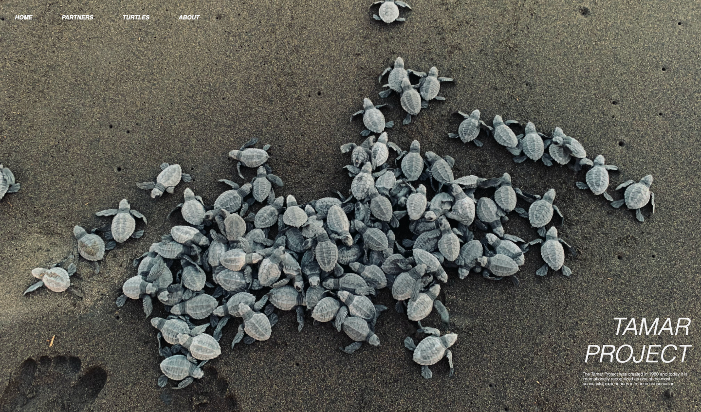

  

<h3>✺ Tamar Project Website ✺</h3>

The Tamar Project Website is a digital platform dedicated to the conservation of sea turtles in Brazil. Developed using HTML, CSS, and JavaScript, this website serves as a window into the world of sea turtle preservation efforts.

<h4>✹ Mission ✹</h4>

The Tamar Project's mission is to protect and conserve sea turtles and their nesting habitats along the Brazilian coast. By combining research, education, and community engagement, the Tamar Project aims to ensure the survival of these magnificent creatures for generations to come.

<h4>✹ Objectives ✹</h4>

The Tamar Project Website strives to achieve the following goals:

* Raise Awareness: The website spreads awareness about the importance of sea turtle conservation, educating the public about the challenges these animals face and the role each person can play in their protection.
* Share Knowledge: The Tamar Project shares its extensive research findings through the website, providing insights into sea turtle behavior, nesting patterns, and the impact of human activities.
* Engage Communities: Through educational programs and events highlighted on the website, the Tamar Project involves local communities in the conservation efforts, fostering a sense of responsibility for marine ecosystems.
* Fundraising: The website serves as a platform for accepting donations, supporting the organization's financial needs for research, rescue operations, and conservation initiatives.

<h4>✹ Design ✹</h4>

The Tamar Project Website features a visually appealing design that reflects the serene marine environment. The color palette and imagery evoke a sense of the ocean, enhancing the visitor's connection to the cause and the animals it aims to protect.

<h4>✹ Features ✹</h4>

* <b>About the Tamar Project:</b> Visitors can learn about the history, values, and achievements of the Tamar Project through informative sections.
* <b>Conservation Efforts:</b> The website highlights the organization's ongoing efforts to protect sea turtles, including rescue missions, nesting site preservation, and community engagement projects.
* <b>Education Programs:</b> The Tamar Project offers educational programs for all ages, and the website provides information about workshops, seminars, and hands-on experiences.
* <b>Get Involved:</b> Visitors can explore ways to get involved, from volunteering opportunities to supporting the organization through donations.
* <b>News and Updates:</b> Stay updated with the latest news, research findings, and success stories related to sea turtle conservation.
* <b>Contact Us:</b> The website offers contact information for those interested in reaching out to the Tamar Project for inquiries, collaboration, or support.

<h4>✹ Contributing to Conservation ✹</h4>

* <b>Support:</b> By visiting the website and learning about sea turtle conservation efforts, you're already contributing to raising awareness.
* <b>Spread the Word:</b> Share the website with your friends, family, and social networks to amplify the message of the Tamar Project and encourage others to join the cause.
* <b>Participate:</b> Explore the "Get Involved" section to find ways to participate, donate, or volunteer, making a direct impact on sea turtle conservation.

<h4>✹ Link to the Project ✹</h4>

<h5>[Insert link to the Tamar Project Website here]</h5>

<h4>✹ Together for Sea Turtles ✹</h4>

Thank you for your interest in the Tamar Project's vital mission. As you engage with the website, remember that every action, big or small, contributes to the well-being of sea turtles and their ocean habitat. Let's unite to protect these remarkable creatures and preserve our marine ecosystems for future generations.
